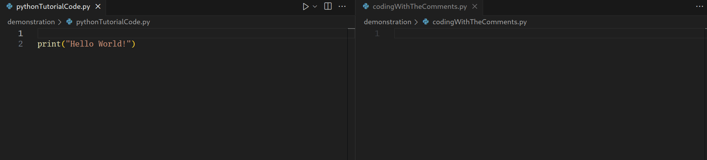
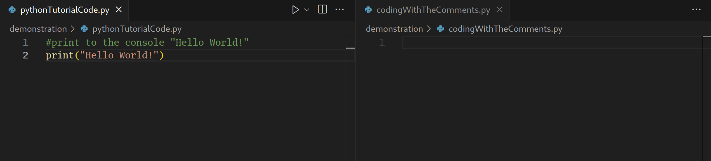

# English Plus
### Introducing English as your first programming language
This visual studio code extension allows you while following a tutorial to add special comments above each line and in another file to start coding with those comments.

## Features
### Simple comments


### Dynamic comments


### Combining comments


### How to use
In file `A` follow a coding tutorial. At any time explain each line with comments. Create new file `B`. Using `ctrl + shift + P` find the command `EnglishPlus: Select file with code from tutorial`. This will link files A and B. Now in the new file B when you start typing a comment it will get auto completed with the ones from file A. At any moment you can hit `tab` to accept any auto completion. If there are arguments like in dynamic comments `tab` will automatically place your cursor in the first argument position. If there is a second argument position pressing `tab` again will move you to it automatically. Hitting 2 times enter or `ctr+enter` and enter will accept the comment and English+ will generate the code. It's two times enter not once because of combining comments. When you press enter once you have the option to write another comment. In that comment if there are places for arguments and you use `_` as an argument, EnglishPlus will use the result of the previous comment and put it into `_`.

Example code following a tutorial with added special comments
```js
//declare variable with name (name) and value (value)
//let (name) = (value)
let score = 0
```
Example programing in another file with those same comments
```js
//declare variable with name (playerHealth) and value (100)
```
Now hitting two times enter the extension will automatically generate the code
```js
//declare variable with name (playerHealth) and value (100)
let playerHealth = 100
```
## Requirements

The extension asks vs code what languages are supported. For example you cannot use initially gdscript but if you have an extension for gdscript now it will be supported.

## Known Issues

For now only languages with line comments are supported(#,//, etc). Some languages have only multiline comments and for now are not supported.

## Release Notes

### 1.0.0

Initial release. Very likely to encounter bugs. Notify me so I can fix them.