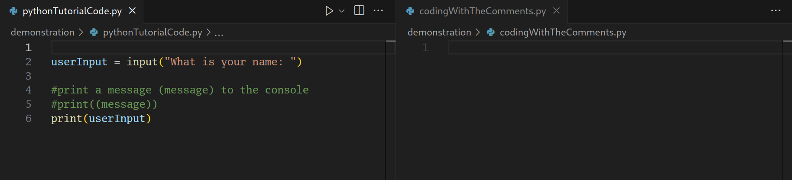

# English Plus
### Introducing English as your first programming language
This visual studio code extension allows you while following a tutorial to add special comments above each line and in another file to start coding with those comments.

## Features
### Simple comments


### Dynamic comments


### Combining comments


Example code following a tutorial with added special comments
```js
//declare variable with name (name) and value (value)
//let (name) = (value)
let score = 0
```
Example programing in another file with those same comments
```js
//declare variable with name (playerHealth) and value (100)
```
Now hitting two times enter the extension will automatically generate the code
```js
//declare variable with name (playerHealth) and value (100)
let playerHealth = 100
```
## Requirements

The extension asks vs code what languages are supported. For example you cannot use initially gdscript but if you have an extension for gdscript now it will be supported.

## Known Issues

For now only languages with line comments are supported(#,//, etc). Some languages have only multiline comments and for now are not supported.

## Release Notes

### 1.0.0

Initial release. Very likely to encounter bugs. Notify me so I can fix them.